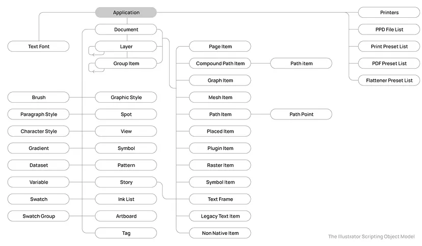

# YACG

## Development

Requires
- Python 3.12
- Adobe Illustrator 2023 (27.3)

### Compile executables
To create the .exe files, install pyinstaller (`pip install pyinstaller`) and run

```bash
pyinstaller scripts/import_to_excel.py -F -c --clean --specpath ./_pyinstaller_cache/ --distpath ./ --workpath ./_pyinstaller_cache/

pyinstaller scripts/export_from_excel.py -F -c --clean --specpath ./_pyinstaller_cache/ --distpath ./ --workpath ./_pyinstaller_cache/
```

### Icon font
The icon font is created from the .svg that live [here](/card_design/icons/). A way of creating the font is by uploading the .svg files to [Glyphter](https://glyphter.com/).

### Modify Illustrator scripts

These scripts are written in Python, using the `pywin32` module to access the Illustrator's COM objects and modify the files.

The complete object reference can be found [here](https://ai-scripting.docsforadobe.dev/jsobjref/javascript-object-reference.html) (it's listed for Javascript, but the references are the same for Python -- these are the COM objects). The main references are summarized in the following object model:



The type library has been generated to [illustrator_com.py](./scripts/yacg_python/illustrador_com.py). Unfortunately, the objects' properties are encoded in `_prop_map_get_` attributes, and IntelliSense's autocomplete can't make sense of them.

#### Generate Illustrator type library

The type library is generated using the `makepy` CLI that comes with the `pywin32` module. This requires some work beforehand 
- Install `pywin32` module (run `pip install pywin32` or equivalent)
- Go to `[path/to/Python3/or/venv]/Scripts`, there should be a `pywin32_postinstall.py` file there
- Run `python pywin32_postinstall.py -install` with admin priviledges

After that, running [generate_illustrator_type_library.py](./scripts/generate_illustrator_type_library.py) will generate the type library.

The documentation for type library generation can be found [here](https://timgolden.me.uk/pywin32-docs/html/com/win32com/HTML/QuickStartClientCom.html).

## Cards YAML structure

### Creature

```yaml
creature:
  # All fields that have gameplay influence
  data:
    name: The Fred
    color: Yellow
    cost-total: 4
    cost-color: 2
    hp: 3
    atk: 1
    spd: 2
    traits: # Max 4
      # Traits are matched by ID, name and description are redundant.
      # They're here to be human-friendly.
      - name: Subtle
        description: Can be cast at any point while the opponent isn't looking
        id: TXXX

  # All fields that have no gameplay influence
  metadata:
    id: CXXX
    # This is a heuristic of how good a card is.
    # Positive value indicates it's too good, negative values indicates it's too bad.
    # It's derived from stats and traits, look into Excel for full computation.
    # Don't try too hard to make this 0, this is just a heuristic.
    value: 10
    # Check Excel for what these mean.
    dev-stage: Discontinued
    # While card has no serious name.
    dev-name: Template creature
    # Used to order cards in Excel.
    order: 0
    # The creature's main idea.
    # Eg: "2-cost red card", "black card with arrogant and defeatist traits, seems funny".
    summary: Showcase creature YAML
    # Notes during card development.
    # Fill this with notes on usage, balancing, etc.
    # Eg: "any cost less than 3 makes this busted", "rejected due to having no counter-play", "value is -20 but that's fine, Haste + Moxie makes up for it").
    notes: |
      * This is a template creature card. Exists purely as a template. Will never be printed. Isn't that so sad?
      * Grouped the fields in "data" and "metadata" groups.
        This way it's obvious what fields have gameplay influence and what fields don't.
```

### Effect

```yaml
effect:
  # All fields that have gameplay influence
  data:
    name: Henrique's Idea
    color: Orange
    # Either "Action", "Field" or "Aura"
    type: Field
    cost-total: 7
    cost-color: 3
    description: |
      Propose a new mechanic. That mechanic is valid for this game.

  # All fields that have no gameplay influence
  metadata:
    id: EXXX
    # Check Excel for what these mean.
    dev-stage: Discontinued
    # While card has no serious name.
    dev-name: Template effect
    # Used to order cards in Excel.
    order: 0
    # The creature's main idea.
    # Eg: "cheap +Atk aura", "black action that gives energy".
    summary: Showcase effect YAML
    # Notes during card development.
    # Fill this with notes on usage, balancing, etc.
    # Eg: "any cost less than 3 makes this busted", "rejected due to having no counter-play", "changed colors, fits blue more").
    notes: |
      * This is a template effect card. Exists purely as a template. Will never be printed. Isn't that so sad?
      * Grouped the fields in "data" and "metadata" groups.
        This way it's obvious what fields have gameplay influence and what fields don't.
```

### Trait

```yaml
trait:
  # All fields that have gameplay influence
  data:
    name: Subtle
    description: |
      Can be cast at any point while the opponent isn't looking

  # All fields that have no gameplay influence
  metadata:
    id: TXXX
    # Either "Cast" (has effect when creature's cast), "Combat" (has effect when creature is in battle) or "Other".
    type: Other
    # How much it's worth for a card to have this. Bad traits have negative value
    value: 35
    # Check Excel for what these mean.
    dev-stage: Discontinued
    # While card has no serious name.
    dev-name: Template trait
    # Used to order cards in Excel.
    order: 0
    # The creature's main idea.
    # Eg: "+Atk if kills creature", "-Spd in the rain".
    summary: Showcase trait YAML
    # Notes during card development.
    # Fill this with notes on usage, balancing, etc.
    # Eg: "creatures with this must cost at least 3", "rejected due to having no counter-play", "can't be paired with arrogance".
    notes: |
      * This is a template trait. Exists purely as a template. Will never be used. Isn't that so sad?
      * Grouped the fields in "data" and "metadata" groups.
        This way it's obvious what fields have gameplay influence and what fields don't.
```